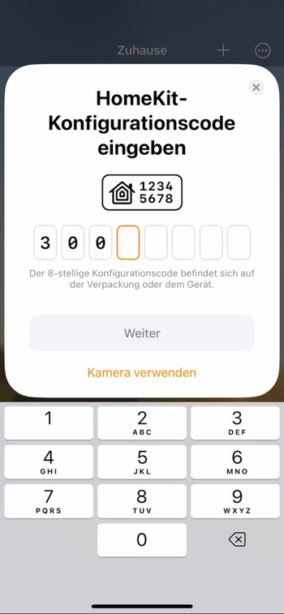

# hk-athome

hk-athome is a simple accessory based on switch to signal
if someone is at home (on) or not(off).

uses the hap-nodejs dependency for the homkit protocol work.


## Run Locally

Clone the project

```bash
  git clone https://github.com/danielkagemann/hk-athome.git
```

Go to the project directory

```bash
  cd hk-athome
```

Install dependencies

```bash
  yarn install
```

Start the server

```bash
  yarn start
```


## Screenshots

Add a new device. You have to ignore QR Camera and select "code input".  


Because of a virtual accessory which is not certified we have to use pin input instead of QR code.  



Select the accessory type you want. Defaults to Switch.  


All done.  


## Authors

- [@danielkagemann](https://www.github.com/danielkagemann)


## Appendix

The typescript version of the hap-nodejs contains an error in the type definition.
So you need to manually change the 

"valid-values-range"?: [min: number, max: number]; 

to

"valid-values-range"?: {min: number, max: number};

in order to successfully build. 
